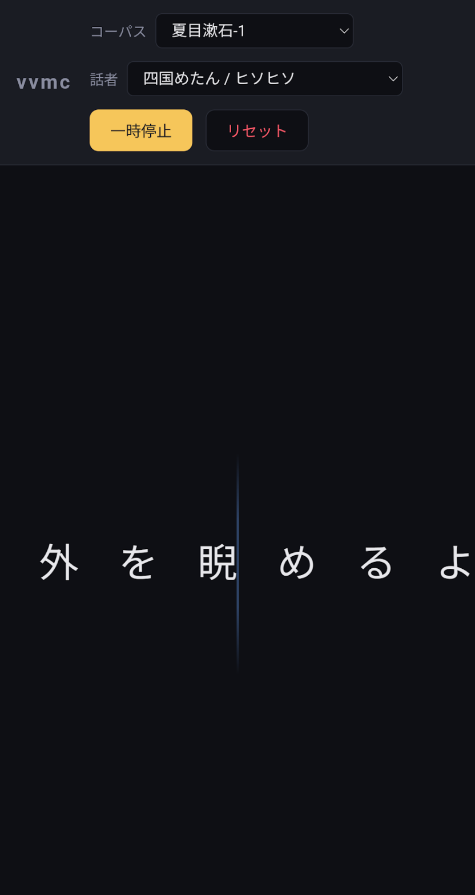

# vvmc

**V**oice**V**ox + **M**arkov **C**hain 。マルコフ連鎖で生成し続けるテキストを VoiceVox
で延々と読み上げる、LAN 内配信用の Web アプリ。



設計判断 / 制約は [CLAUDE.md](./CLAUDE.md) に集約している。

## クイックスタート

学習元テキストを **コーパス = フォルダ** の形で用意する (青空文庫の .txt を想定):

```bash
mkdir -p corpus/wagahai
# 例: 夏目漱石『吾輩は猫である』を "wagahai" コーパスとして配置
curl -L -o /tmp/wagahai.zip "https://www.aozora.gr.jp/cards/000148/files/789_ruby_5639.zip"
unzip -p /tmp/wagahai.zip '*.txt' | iconv -f cp932 -t utf-8 > corpus/wagahai/wagahai.txt

# 別コーパスを足す場合は別フォルダを切る
mkdir -p corpus/akutagawa
# ... akutagawa 関連の .txt を配置
```

1 フォルダ = 1 マルコフチェイン。フォルダ名がそのまま UI の選択肢になる。同じ
フォルダに複数の .txt を置くと全部まとめて 1 つのチェインを学習する。

### 本番(LAN 配信)

```bash
docker compose up --build
```

同一 LAN のブラウザから `http://<サーバの LAN IP>:8000` にアクセス。

### 開発(hot reload)

```bash
docker compose -f docker-compose.yml -f docker-compose.dev.yml up --build
```

- Vite dev server: `http://<LAN IP>:5173`
- backend API: `http://<LAN IP>:8000`

フロントの変更は 5173 で、バックエンドの変更は `--reload` で自動反映される。

## スタック概要

| レイヤ | 採用 |
|---|---|
| VoiceVox | `voicevox/voicevox_engine:cpu-latest` |
| バックエンド | Python 3.12 + FastAPI + uvicorn + fugashi + unidic-lite |
| フロントエンド | Vite + React + TypeScript + Web Audio API |

詳細と選定理由は CLAUDE.md を参照。

## API

- `GET  /api/speakers`   … VoiceVox の話者一覧
- `GET  /api/corpora`    … 学習済みコーパス名の一覧
- `POST /api/sentence`   `{ speaker_id, corpus_name }` → `{ text, audio(base64 wav), mora[] }`
- `POST /api/reset`      `{ corpus_name? }` … 指定コーパスの乱数状態を初期化(省略で全部)
- `GET  /api/health`     … ヘルスチェック

## ポート

| サービス | ポート | 用途 |
|---|---|---|
| backend | 8000 | API + 静的ファイル配信 |
| frontend (dev) | 5173 | Vite dev server |
| voicevox | 50021 | LAN 非公開、内部ネットワークのみ |
